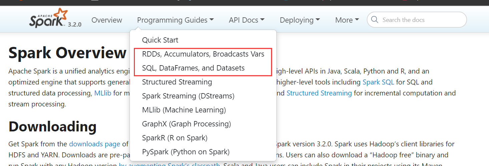

# PTBSpark

**2021.10.28** 

只是看Spark的源码，总觉得欠缺些什么。可能是每个程序员都有一颗造轮子的心吧，打算尝试从0开始实现一个吧。

希望能通过这个项目加深我对Spark的理解、还有码代码的能力吧。由于以前没做过这种事情，开发语言上还是选择了原生的scala和Java。

毕竟go还不熟悉，只能简单用用。

关于项目名PSpark 其实是 pretend to be Spark 假装自己是Spark。

Spark是一个分布式计算框架，擅长处理批任务,也能基于微批做流式计算。但在流计算方面，大家更倾向于Flink。
从官网上可以看到，Spark自身划分了好几大功能模块, 但该项目只尝试去复现这两块的功能。

