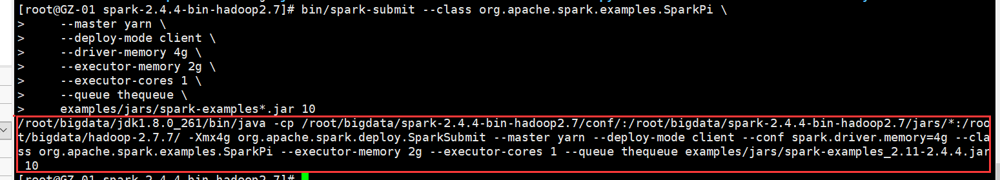
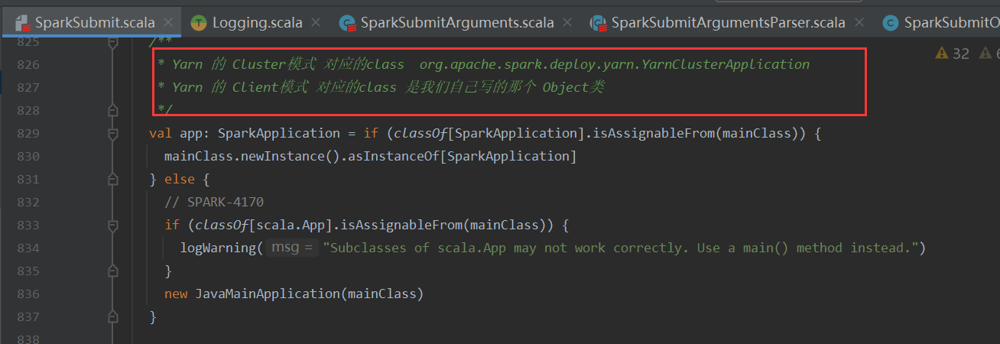

# 版本说明

该文档是v0.01版本文档。该版本的***目标是能够实现最基本的，大数据框架的HelloWord（单词统计）***。
为此，**我们需要思考一个Spark程序跑起来需要些什么？** 下面整个v0.01版本的设计思考过程以及最终的开发工作列表。

# 开发工作列表


1. 启动脚本spark-submit.sh
2. 程序入口SparkSubmit
3. 核心: SparkContext
4. 核心: RDD


# 设计过程

## Spark-submit.sh

以RDD API为例，我们开发完，然后将`Spark`程序后打包成jar，通过`spark-submit`命令提交给资源管理集群运行。以`Yarn`为例，提交命令如下

```shell
spark-submit --class org.apache.spark.examples.SparkPi \
    --master yarn \
    --deploy-mode cluster \
    --driver-memory 4g \
    --executor-memory 2g \
    --executor-cores 1 \
    --queue thequeue \
    examples/jars/spark-examples*.jar 10 
```

`spark-submit`是一个shell脚本，做一些环境变量设置，拼接Java命令然后启动一个Java进程。
根据上述命令中的参数值`--deploy-mode`决定该Java的主类是什么。如果deploy-mode为client则，主类就是我们的main方法所在类.
该启动的Java进程. 

可以通过以下命令查看具体拼接后的 启动命令

```shell
sh -x spark-submit xxxxxxxx 
```

 或者修改 `spark-submit.sh`脚本 输出最后的命令

```shell
CMD=("${CMD[@]:0:$LAST}")
echo "${CMD[@]}"  # 输出 拼接后的Java命令

# 因为我的环境只是临时找个服务器装的Spark,没有Yarn,所以注释掉了执行Java命令的语句
# exec "${CMD[@]}"   
```

执行spark-submit得到拼接后的命令：



<font color='red'>因此对于第一版，spark-submit.sh脚本拼接Java命令，并执行Java命令。</font>

spark-submit输出的命令贴在这里，方便后续使用：

```
/root/bigdata/jdk1.8.0_261/bin/java -cp /root/bigdata/spark-2.4.4-bin-hadoop2.7/conf/:/root/bigdata/spark-2.4.4-bin-hadoop2.7/jars/*:/root/bigdata/hadoop-2.7.7/ org.apache.spark.deploy.SparkSubmit --master yarn --deploy-mode cluster --conf spark.driver.memory=4g --class org.apache.spark.examples.SparkPi --executor-memory 2g --executor-cores 1 --queue thequeue examples/jars/spark-examples_2.11-2.4.4.jar 10
```


## SparkSubmit.scala

执行`spark-submit.sh`就会启动一个Java进程，入口是SparkSubmit伴生对象的main方法。该类的作用是解析`spark-submit`脚本提交时传递的参数(就是 --master那一堆 )  以及从默认的配置文件加载Spark的参数。 最后根据参数得到一个类名，通过反射的方式去创建该类对象。如果是Client模式，该Java进程就是我们的Driver进程。



出于最简的考虑，第一版不需要考虑集群模式，只需要考虑将Driver启动即可。也就是说`SparkSubmit.scala`中只需要校验参数是否正确以及反射出主类运行其main方法即可。


## SparkContext

一个`HelloWrod`的代码如下，SparkSession是DataSet、DataFrame的入口，RDD的入口还是SparkContext。出于最简考虑，SparkSession等到后续实现SQL模块才实现。

```scala
val sparkConf = new SparkConf().setAppName("HelloWord")
val spark = new SparkContext(sparkConf)
// HadoopRDD
val rdd1 = spark.textFile("", 3)
// MapPartitionsRDD   默认 patitioner 为None
val rdd2 = rdd1.flatMap(line => {
    line.split(",")
})
// MapPartitionsRDD
val rdd3 = rdd2.map(word => (word, 1))
// ShuffledRDD
var rdd4 = rdd3.reduceByKey((a, b) => {
    a + b
})
val result = rdd4.collect();
print(result);
```

SparkContext初始化会做很多事情。
